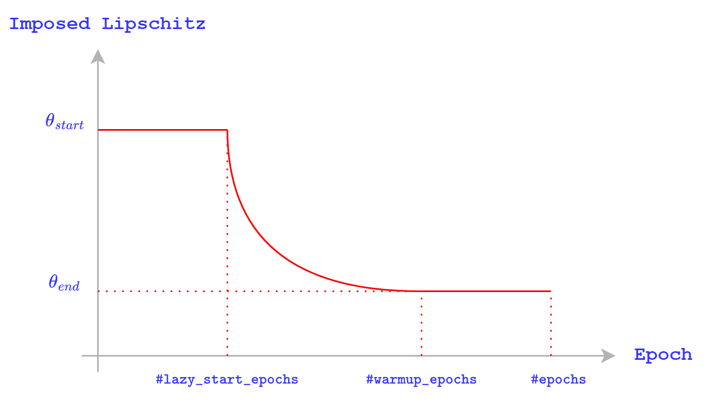

<style type="text/css">
.generated-text {
   font-family:'Courier New', monospace;
   font-size:44px;
   line-height:20px;
   text-align:center;
   font-weight: bold;
   background: linear-gradient(90deg, #f36969 31%, #0f73c0 64%);
  color: transparent;
  -webkit-background-clip: text;
  background-clip: text;
  -webkit-text-fill-color: transparent;
  text-fill-color: transparent;
   padding:20px;
}
</style>
<div class="generated-text">ABBA Neural Networks</div>

<hr>

This repo contains functionalities for training ABBA Neural Networks with Lipschitz constraints for Adversarial Robustness, for the algorithms described in:


- [ABBA Neural Networks: Coping with Positivity, Expressivity, and Robustness](https://hal.science/hal-04386260/), SIAM SIMODS 2024

- [Are almost non-negative neural networks universal approximators?](https://ieeexplore.ieee.org/stamp/stamp.jsp?arnumber=10734768), MLSP 2024

We provide additional results in the supplementary material, along with an analysis for the computation time. The full journal paper + supplementary can be accessed [here](https://hal.science/hal-04386260v2/file/ABBA_Neural_Networks.pdf).

Training is performed using [Lightning Fabric](https://lightning.ai/docs/fabric/stable/).


# Getting Started

Clone the repo:

```bash
git clone https://github.com/Vladimirescu/ABBA-Neural-Networks-torch.git
```

Create new environment:

Option #1: ```venv```

```bash
python -m venv abba
source abba/bin/activate
pip install -r requirements.txt
```

Option #2: ```conda```

```bash
conda create --name new_env python=3.9
conda activate new_env
pip install -r requirements.txt
```

Create a `TORCH_DATASETS_PATH` env variable to store the path to your datasets directly loaded through `torch`:

```bash
export TORCH_DATASETS_PATH=<your_path>
```

# Usage

For both training and testing a `.yaml` configuration file, with name equal to dataset name should be placed in `./configs`. We'll update it with all remaining datasets soon ... 

**Note**: All images are normalized to [-1, 1]

## Training a model

```bash
python train.py <dataset> --save_p <checkpoint_path>
```

## Testing a model

### Adversarial attacks performance

```bash
python attack.py <dataset> <checkpoint_path>
```

**Note**: The estimated network bounds (i.e. `Total prod`) don't include the contribution of aggregation operators (e.g. `AvgPool2d`). 

### xAi performance 🚧 

```TBA```

### Testing Pre-trained Models 🚧 

```TBA```

### Training with a Lipschitz scheduler

We find that, in some cases, using a scheduler over the imposed Lipschitz bound during training helps with convergence. In the diagram below such a scheduler is exemplified:



This results in a final model with Lipschitz bound constrained to $\theta_{end}$. The scheduler parameters can be controlled through the `.yaml` configs used for training: 

- $\theta_{start}$ : `lip_start`
- $\theta_{end}$ : `lip`

All other parameters are named similarly. If you want to train without a Lipschitz scheduler, set `lip_start = lip`.


## 📓 Citations

If you find our work useful, consider citing the following:

```
@article{neaccsu2024abba,
  title={ABBA neural networks: Coping with positivity, expressivity, and robustness},
  author={Neac{\c{s}}u, Ana and Pesquet, Jean-Christophe and Vasilescu, Vlad and Burileanu, Corneliu},
  journal={SIAM Journal on Mathematics of Data Science},
  volume={6},
  number={3},
  pages={649--678},
  year={2024},
  publisher={SIAM}
}
```

```
@inproceedings{vasilescu2024almost,
  title={Are almost non-negative neural networks universal approximators?},
  author={Vasilescu, Vlad and Neac{\c{s}}u, Ana and Pesquet, Jean-Christophe},
  booktitle={2024 IEEE 34th International Workshop on Machine Learning for Signal Processing (MLSP)},
  pages={1--6},
  year={2024},
  organization={IEEE}
}
```

# MLSP 2024 Poster 📎
